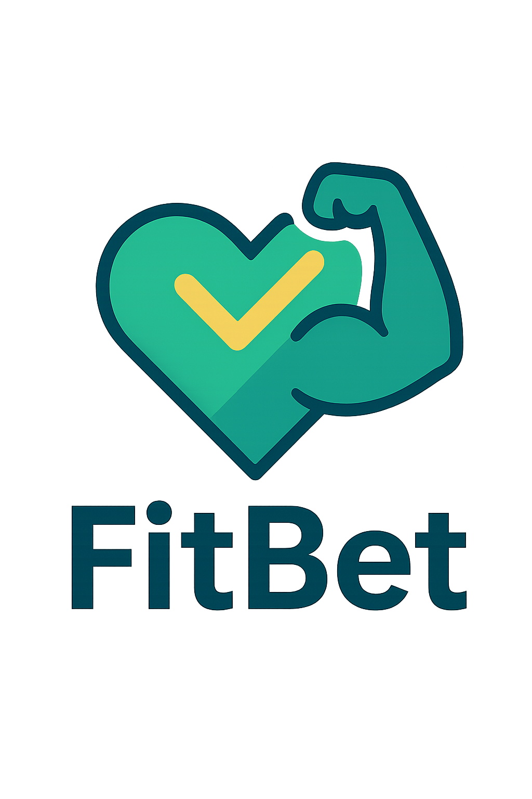

# FitBet



FitBet é uma plataforma web para criar e participar de apostas fitness entre amigos. Desafie seus amigos em objetivos como emagrecimento, ganho muscular, corrida, e outras atividades físicas - sem envolver dinheiro, apenas saúde e motivação.

## 📋 Visão Geral

FitBet permite que você:
- Crie desafios fitness para seus amigos
- Acompanhe seu progresso em diversas atividades físicas
- Participe de competições saudáveis para manter a motivação
- Conquiste metas de saúde em um ambiente social e divertido

## 🚀 Demonstração

[Demo ao vivo (em breve)]()

## 🛠️ Tecnologias

Este projeto utiliza as seguintes tecnologias:

- **Frontend**:
  - [Next.js 14+](https://nextjs.org/)
  - [React](https://reactjs.org/)
  - [TypeScript](https://www.typescriptlang.org/)
  - [TailwindCSS](https://tailwindcss.com/) para estilização
  - Componentes animados com CSS e JavaScript

## 🏗️ Estrutura do Projeto

O projeto é organizado da seguinte forma:

```
src/
├── app/               # Configurações e rotas do Next.js
├── components/        # Componentes React reutilizáveis
│   ├── ui/            # Componentes de UI básicos
│   ├── Hero.tsx       # Componente Hero da página inicial
│   ├── Header.tsx     # Cabeçalho do site
│   └── ...
├── lib/               # Funções utilitárias, hooks, etc.
└── utils/             # Funções auxiliares
```

## 🔧 Instalação e Uso

### Pré-requisitos
- Node.js 18.0.0 ou superior
- npm ou yarn

### Passos para instalação

1. Clone o repositório
```bash
git clone https://github.com/seu-usuario/fit-bet.git
cd fit-bet
```

2. Instale as dependências
```bash
npm install
# ou
yarn install
```

3. Execute o servidor de desenvolvimento
```bash
npm run dev
# ou
yarn dev
```

4. Abra [http://localhost:3000](http://localhost:3000) no seu navegador para ver o resultado.

## 🚢 Deploy

Para build e deploy do projeto:

```bash
npm run build
npm run start
```

O projeto é compatível com diversos provedores de hospedagem como Vercel, Netlify e outros.

### Opções recomendadas de deploy

1. **Vercel (Mais fácil)**: 
   - Conecte seu repositório GitHub 
   - A Vercel detectará automaticamente seu projeto Next.js

2. **Netlify**: 
   - Build command: `npm run build`
   - Publish directory: `.next`

## 🧠 Conceitos

O FitBet se baseia em alguns conceitos chave:

- **Apostas saudáveis**: Competições amigáveis focadas em saúde, não em dinheiro
- **Progresso monitorado**: Acompanhamento de atividades físicas e métricas de saúde
- **Motivação social**: Utilização do círculo social para manter a motivação

## 🤝 Contribuição

Este projeto é para estudo e desenvolvimento pessoal, mas sugestões são sempre bem-vindas!

## 📝 Licença

[MIT](LICENSE)

## 🧑‍💻 Autor

- [@andreluiz901](https://github.com/andreluiz901) - Desenvolvedor e idealizador

---

Desenvolvido com 💚 para promover saúde e bem-estar.
